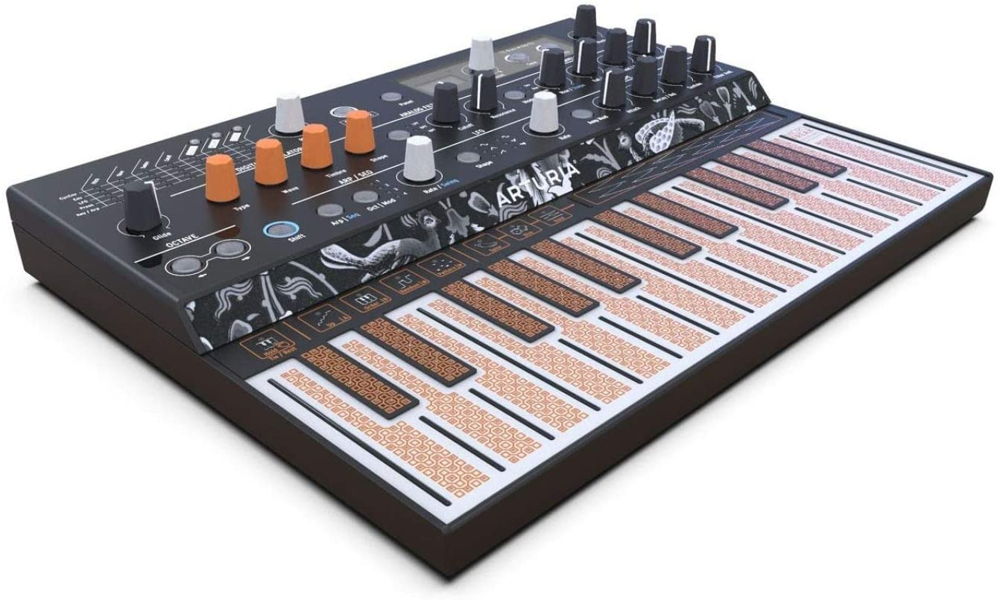
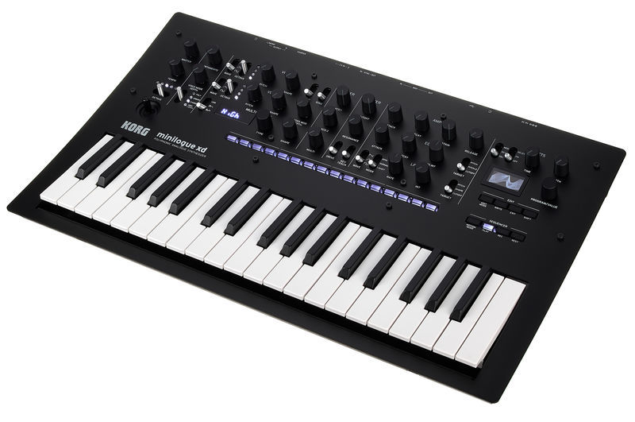
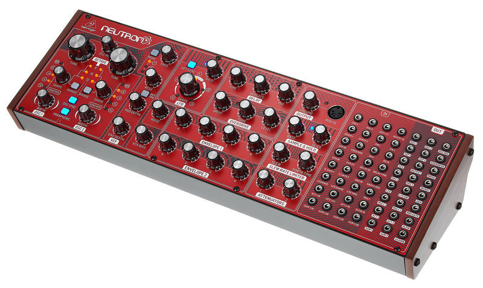
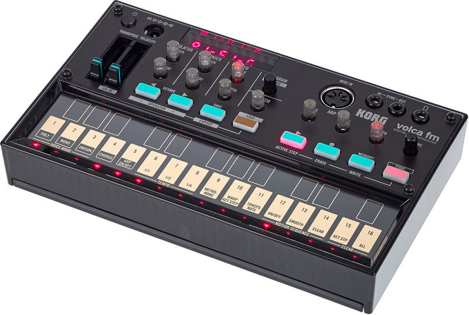
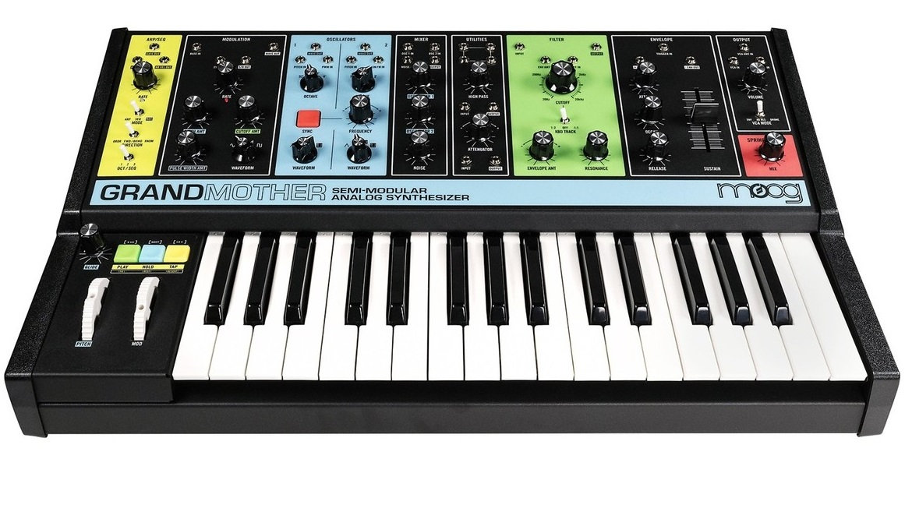

## The best synthesizers of 2021
Lorem, ipsum dolor sit amet consectetur adipisicing elit. Accusantium, necessitatibus officiis deleniti, eos odit iste perferendis dolore nostrum soluta autem quia totam! Ducimus iste non quibusdam! Facilis dolore et quod!
Quo error perspiciatis aspernatur iure dolore ipsum, illo, voluptate commodi dolor dicta eum neque quas est in ab deleniti dolores distinctio eius quasi sapiente quis rem earum laborum. Possimus, voluptate.
Ea beatae illo sunt, eveniet corporis, officiis laboriosam quia earum quas reprehenderit, doloremque nam vel pariatur saepe? Asperiores non, molestiae sint perferendis, itaque tempora dignissimos praesentium dolor veritatis qui eum.
Voluptas incidunt atque molestias earum, corrupti exercitationem eum laborum blanditiis iusto ipsum inventore provident, qui ullam doloremque quasi explicabo, commodi adipisci fuga tempora facilis! Voluptatem modi veniam facilis velit aliquid?
Quibusdam optio nostrum nisi, error necessitatibus minima odit facere laborum commodi quis velit possimus natus, nemo accusantium deleniti, omnis voluptates non tempore officia fuga. Labore deleniti voluptate animi corporis praesentium.

### 1. Arturia MicroFreak

With so many synthesis features packed into such a small box, it’s hard not to fall in love with Arturia’s latest hardware offering. The multiple oscillator modes cover a near-endless range of timbres; the filter is smooth and versatile; the Matrix invites exploratory modulation; and the performance and sequencing tools are the icing on the creative cake. However, the real magic lies in the combo of all these together, making this odd little beast far more than the sum of its parts. MicroFreak should be top of your ‘must try’ list. 

### 2. Korg Minilogue XD

This new model slots comfortably into the Logue range between the original Minilogue and the Prologue 8. If we had to choose between this and the original Minilogue, it’d be the XD due to its more powerful sequencer, extended general versatility, user-customisable Multi-Engine/effects, the joystick for real-time control, user scales/tunings, more inspiring vibe and excellent motion-sequenceable stereo effects/output. Along with the new damper pedal jack and dual-CV inputs (to interface with modular gear), the XD is a nicely different flavour of Minilogue, and its unique personality is a hugely welcome addition to the range as a whole. 

### 3. Behringer Neutron

The Volca FM is a compact, battery-powerable instrument, housed in a plastic chassis with a design that gives a cheeky stylistic nod to the Yamaha DX7 from which it takes its sonic cues. It's equipped with a ribbon-style keyboard-come-sequencer, built-in speaker, MIDI input and 3.5mm sync in/out. This is easily the best of the Volca range so far. Where the other models have merely captured the general vibe of the instruments they took their inspiration from - albeit in a very fun and affordable way - the FM manages not only to nail the sound of its spiritual predecessor, but also adds an assortment of new and powerful features.

### 4. Korg Volca FM

The Volca FM is a compact, battery-powerable instrument, housed in a plastic chassis with a design that gives a cheeky stylistic nod to the Yamaha DX7 from which it takes its sonic cues. It's equipped with a ribbon-style keyboard-come-sequencer, built-in speaker, MIDI input and 3.5mm sync in/out. This is easily the best of the Volca range so far. Where the other models have merely captured the general vibe of the instruments they took their inspiration from - albeit in a very fun and affordable way - the FM manages not only to nail the sound of its spiritual predecessor, but also adds an assortment of new and powerful features. It's not without its limitations - the lack of polyphony leaves it lagging behind the original DX7, Yamaha's Reface DX, and the various FM plugins out there - but the sound of those dark, percussive basses, icy mallets and '80s-style horns is bang on, and if you start to push the capabilities of this tweakable, hands-on little synth, you'll find it's capable of some truly unique tricks.

### 5. Moog Grandmother

Moog’s latest semi-modular comes equipped with a 32-note Fatar keyboard, sequencer and arp, making it more performance-focussed than its siblings in the Mother line. It has a chic multi-coloured retro design that suits its authentic vintage sound. The old-school approach is rounded off nicely with the inclusion of a spring reverb module – a rare inclusion in modern synths. Grandmother is a versatile performer, capable of a vast range of sounds even before patching a cable. Is it worth the asking price? Absolutely, if for no other reason than providing users with a taste of those old Moog modular circuits without having to take out a second mortgage.