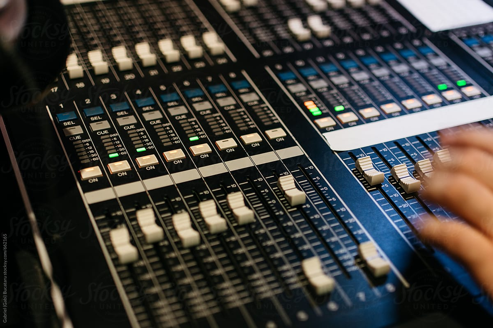

## Virtual Studio Technology (VST) 
Virtual Studio Technology (VST) is an audio plug-in software interface that integrates software synthesizers and effects units into digital audio workstations. VST and similar technologies use digital signal processing to simulate traditional recording studio hardware in software. Thousands of plugins exist, both commercial and freeware, and many audio applications support VST under license from its creator, Steinberg.
VST plugins generally run within a digital audio workstation (DAW), to provide additional functionality, though a few standalone plugin hosts exist which support VST. Most VST plugins are either instruments (VSTi) or effects (VSTfx), although other categories exist—for example spectrum analyzers and various meters. VST plugins usually provide a custom graphical user interface that displays controls similar to physical switches and knobs on audio hardware. Some (often older) plugins rely on the host application for their user interface.

### Overview

VST instruments include software simulation emulations of well-known hardware synthesizers and samplers. These typically emulate the look of the original equipment as well as its sonic characteristics. This lets musicians and recording engineers use virtual versions of devices that otherwise might be difficult and expensive to obtain.

VST instruments receive notes as digital information via MIDI, and output digital audio. Effect plugins receive digital audio and process it through to their outputs. (Some effect plugins also accept MIDI input—for example, MIDI sync to modulate the effect in sync with the tempo). MIDI messages can control both instrument and effect plugin parameters. Most host applications can route the audio output from one VST to the audio input of another VST (chaining). For example, the output of a VST synthesizer can be sent through a VST reverb effect.

### History

Steinberg released the VST interface specification and SDK in 1996. They released it at the same time as Steinberg Cubase 3.02, which included the first VST format plugins: Espacial (a reverb), Choirus (a chorus effect), Stereo Echo, and Auto-Panner.

Steinberg updated the VST interface specification to version 2.0 in 1999. One addition was the ability for plugins to receive MIDI data. This supported the introduction of Virtual Studio Technology Instrument (VSTi) format plugins. VST Instruments can act as standalone software synthesizers, samplers, or drum machines.
Neon was the first available VST Instrument (included with Cubase VST 3.7). It was a 16-voice, 2-oscillator virtual analog synthesizer.

In 2006, the VST interface specification was updated to version 2.4. Changes included the ability to process audio with 64-bit precision. A free-software replacement was developed for LMMS that would be used later by other free-software projects.

VST 3.0 came out in 2008. Changes included:
Audio Inputs for VST Instruments
Multiple MIDI inputs/outputs
Optional SKI (Steinberg Kernel Interface) integration
VST 3.5 came out in February 2011. Changes included note expression, which provides extensive articulation information in individual note events in a polyphonic arrangement. According to Steinberg, this supports performance flexibility and a more natural playing feel.

In October 2011, Celemony Software and PreSonus released Audio Random Access (ARA), an extension for audio plug-in interfaces, such as VST, allowing greater integration between audio plug-ins and DAW software.
In September, 2013, Steinberg discontinued maintenance of the VST 2 SDK. In December, Steinberg stopped distributing the SDK. The higher versions are continued.
VST 3.6.7 came out in March, 2017. It includes a preview version of VST3 for Linux platform, the VST3 part of the SDK gets a dual license: "Proprietary Steinberg VST3" or the "Open-source GPLv3".

As VSTi virtual instrument technology was under development at Steinberg, a platform for virtual instruments using DirectX engine technology was being developed by Cakewalk, famous for its Sonar DAW. However, the format did not gain much acceptance beyond instruments bundled with SONAR. Currently, almost all virtual instruments on the market use Steinberg's VSTi format