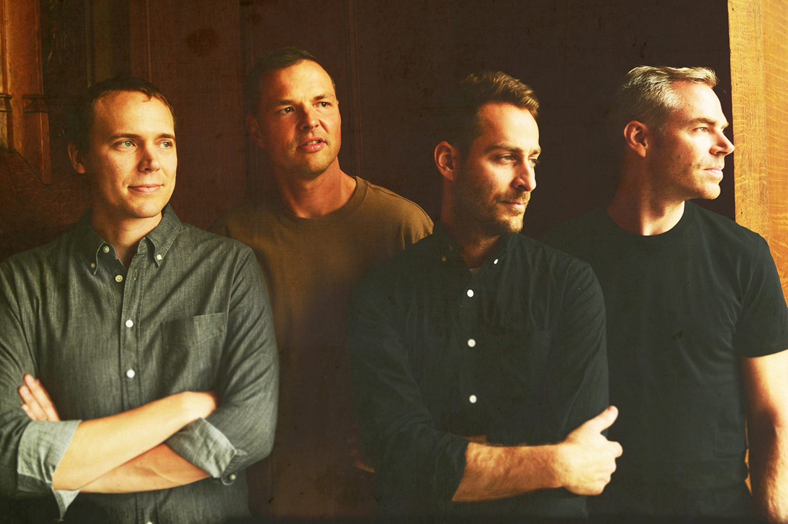

## So what is it
Math rock is a style of progressive and indie rock with roots in bands such as King Crimson and Rush as well as 20th-century minimal music composers such as Steve Reich. It is characterized by complex, atypical rhythmic structures (including irregular stopping and starting), counterpoint, odd time signatures, angular melodies, and extended, often dissonant, chords. It bears similarities to post-rock.

### Characteristics
Math rock is typified by its rhythmic complexity, seen as mathematical in character by listeners and critics. While most rock music uses a 4/4 meter (however accented or syncopated), math rock makes use of more non-standard, frequently changing time signatures such as 7/8, 11/8, or 13/8.
As in traditional rock, the sound is most often dominated by guitars and drums. However, drums play a greater role in math rock in providing driving complex rhythms. Math rock guitarists make use of tapping techniques and loop pedals to build on these rhythms, as illustrated by songs like those of 'math rock supergroup' Battles.
Lyrics are generally not the focus of math rock; the voice is treated as just another instrument in the mix. Often, vocals are not overdubbed, and are positioned less prominently, as in the recording style of Steve Albini, or Rolling Stones producer Jimmy Miller. Many of math rock's best-known groups are entirely instrumental such as Don Caballero or Hella.

The term began as a joke but has developed into the accepted name for the musical style. One advocate of this is Matt Sweeney, singer with Chavez, a group often linked to the math rock scene. Another influence is Canadian indie rocker Dan Snaith, who earned a PhD in mathematics from Imperial College London. Despite this, not all critics see math rock as a serious sub-genre of rock.
A significant intersection exists between math rock and emo, exemplified by bands such as Tiny Moving Parts or American Football, whose sound has been described as "twinkly, mathy rock, a sound that became one of the defining traits of the emo scene throughout the 2000s."

### Bands
### 1. American Football

Lorem, ipsum dolor sit amet consectetur adipisicing elit. Accusantium, necessitatibus officiis deleniti, eos odit iste perferendis dolore nostrum soluta autem quia totam! Ducimus iste non quibusdam! Facilis dolore et quod!
Quo error perspiciatis aspernatur iure dolore ipsum, illo, voluptate commodi dolor dicta eum neque quas est in ab deleniti dolores distinctio eius quasi sapiente quis rem earum laborum. Possimus, voluptate.
Ea beatae illo sunt, eveniet corporis, officiis laboriosam quia earum quas reprehenderit, doloremque nam vel pariatur saepe? Asperiores non, molestiae sint perferendis, itaque tempora dignissimos praesentium dolor veritatis qui eum.
Voluptas incidunt atque molestias earum, corrupti exercitationem eum laborum blanditiis iusto ipsum inventore provident, qui ullam 

### 2. tricot

Lorem, ipsum dolor sit amet consectetur adipisicing elit. Accusantium, necessitatibus officiis deleniti, eos odit iste perferendis dolore nostrum soluta autem quia totam! Ducimus iste non quibusdam! Facilis dolore et quod!
Quo error perspiciatis aspernatur iure dolore ipsum, illo, voluptate commodi dolor dicta eum neque quas est in ab deleniti dolores distinctio eius quasi sapiente quis rem earum laborum. Possimus, voluptate.

### 3. Chon

Lorem, ipsum dolor sit amet consectetur adipisicing elit. Accusantium, necessitatibus officiis deleniti, eos odit iste perferendis dolore nostrum soluta autem quia totam! Ducimus iste non quibusdam! Facilis dolore et quod!
Quo error perspiciatis aspernatur iure dolore ipsum, illo, voluptate commodi dolor dicta eum neque quas est in ab deleniti dolores distinctio eius quasi sapiente quis rem earum laborum. Possimus, voluptate rem earum laborum. Possimus, voluptate.

### 4. Polyphia

Lorem, ipsum dolor sit amet consectetur adipisicing elit. Accusantium, necessitatibus officiis deleniti, eos odit iste perferendis dolore nostrum soluta autem quia totam! Ducimus iste non quibusdam! Facilis dolore et quod!
Quo error perspiciatis aspernatur iure dolore ipsum, illo, voluptate commodi dolor dicta eum neque quas est in ab deleniti dolores distinctio eius quasi sapiente quis rem earum laborum. Possimus, voluptate rem earum laborum. Possimus, voluptate. Possimus, voluptate rem earum laborum. Possimus, voluptate.
